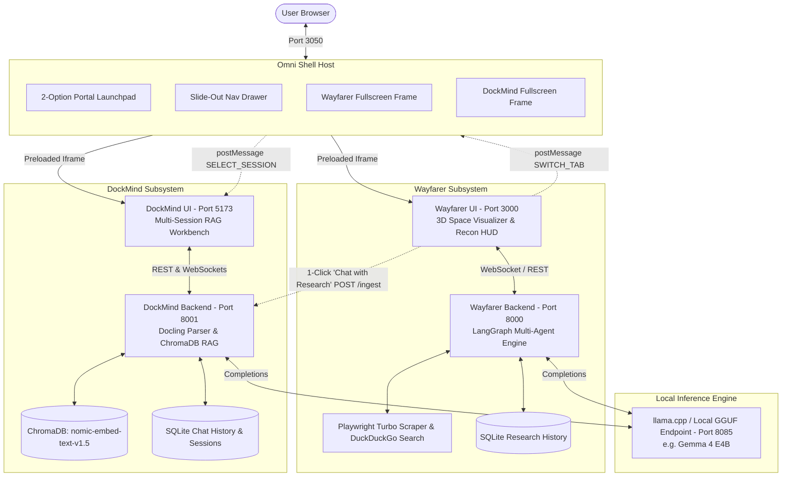

<div align="center">

  

  <h1 align="center">AEGIS</h1>

  <p align="center">
    <strong>Autonomous Deep Research & Local-First Document Intelligence Nexus</strong>
  </p>

  <p align="center">
    <a href="https://fastapi.tiangolo.com/"></a>
    <a href="https://reactjs.org/"></a>
    <a href="https://vitejs.dev/"></a>
    <a href="https://langchain-ai.github.io/langgraph/"></a>
    <a href="https://www.trychroma.com/"></a>
    <a href="https://playwright.dev/"></a>
    <a href="https://github.com/DS4SD/docling"></a>
    <a href="https://github.com/ggerganov/llama.cpp"></a>
  </p>

</div>

---

## 🌟 Overview

**Aegis** is an enterprise-grade, 100% offline and local-first AI intelligence nexus combining autonomous multi-agent deep research with document intelligence and dense vector RAG (Retrieval-Augmented Generation). 

Designed to run completely private on local consumer hardware (e.g., RTX 4060 8GB VRAM / 24GB RAM with local GGUF models like `Gemma 4 e4b` or via NVIDIA NIM Cloud endpoints), Aegis eliminates cloud dependencies, data leakage, and SaaS subscription costs while delivering deep academic research synthesis and document query capabilities.

---

## 🧭 User Experience Flow

```
                                    +-----------------------+
                                    |     AEGIS NEXUS       |
                                    |  (Initial Launchpad)  |
                                    +-----------+-----------+
                                                |
                       +------------------------+------------------------+
                       |                                                 |
                       v                                                 v
           [ KEY: 1 ] Click                                  [ KEY: 2 ] Click
        +----------------------+                          +----------------------+
        | 🌌 WAYFARER          |                          | 🧠 DOCKMIND          |
        | Deep Research Engine |                          | Document RAG Chat    |
        +----------+-----------+                          +----------+-----------+
                   |                                                 |
                   +------------------------+------------------------+
                                            |
                                            v
                               +-------------------------+
                               | In-App Slide-Out Drawer |
                               |  - [1] Switch Wayfarer  |
                               |  - [2] Switch DockMind  |
                               |  - [H] Return Launchpad |
                               |  - [Esc] Fullscreen     |
                               +-------------------------+
```

1. **Initial Portal Launchpad**: On boot, Aegis greets you with a clean, maximalist welcome hub featuring **only the 2 core hero options**: **Wayfarer** and **DockMind**.
2. **Dedicated Fullscreen Workspace**: Selecting an app launches into a full-bleed `100vw x 100vh` workspace without any obstructive static sidebars or top headers.
3. **Slide-Out Navigation Drawer**: A subtle cyber pill trigger `[ ✦ AEGIS / AppName ▼ ]` on the top-left edge slides out a sleek glassmorphic navigation drawer for instantaneous app switching or returning home.

---

## 🏛️ System Architecture

Aegis is engineered with an **Omni Microservice Architecture** that isolates UI frameworks to prevent styling collisions while offering seamless inter-process communication:



---

## ⚡ Key Features

### 🌌 1. Wayfarer Deep Research Console
- **LangGraph Multi-Agent Architecture**: Autonomous orchestration between **Planner**, **Researcher**, **Critic**, and **Writer** nodes.
- **3D Celestial Astrolabe & Reconnaissance HUD**: Live Three.js cinematic space visualizer tracking active probes, planetary round progress, live search queries, and scraped URLs in real time.
- **Turbo Headless Web Extraction**: Powered by Playwright Chromium and DuckDuckGo search for rapid web harvesting.
- **Interactive Section-Level Refinement**: In-place research refinement (`/api/refine-section`) allowing users to rewrite and expand specific sections (or the entire report) with custom instructions without restarting the entire research loop.
- **Persistent History & Formats**: SQLite storage for research sessions with instant downloads in Markdown, HTML, Plain Text, and DOC.

### 🧠 2. DockMind Document Intelligence & RAG
- **Elite Docling Parsing**: High-fidelity document parsing for PDFs, DOCX, TXT, and Markdown files with preserved tables, hierarchy, and equations.
- **Dense Vector Search**: Powered by ChromaDB with `nomic-embed-text-v1.5` embeddings and semantic chunk boundaries (1500 chars).
- **Multi-Session Chat & Memory**: SQLite session and message tracking with full chat persistence across restarts.
- **Pure Local LLM Support**: Optimized prompt templates with repetition mitigation for local small and reasoning LLMs.

### 🌉 3. The Neural Bridge
- **Instant Research Handoff**: Click **"Chat with this Research"** inside Wayfarer to automatically create a named session in DockMind, parse and vector-index the Markdown report into ChromaDB, and focus the chat tab in zero milliseconds.

---

## 🎮 Global Keyboard Shortcuts

| Key | Action |
|---|---|
| **`1`** | Instantly launch / switch to **Wayfarer Deep Research** |
| **`2`** | Instantly launch / switch to **DockMind Document Chat** |
| **`H`** | Return to the **Portal Launchpad** (Home Hub) |
| **`Esc`** | Close the slide-out navigation drawer and return to fullscreen |

---

## 🔌 Port Mapping & Services

| Service | Port | Description | Technology |
|---|---|---|---|
| **Omni App Shell** | `3050` | Quantum Launchpad & Slide Drawer | Vite + React |
| **Wayfarer Frontend** | `3000` | Research Visualizer & HUD | Vite + React + Three.js |
| **Wayfarer Backend** | `8000` | Multi-Agent Research Graph | FastAPI + LangGraph + Playwright |
| **DockMind Frontend** | `5173` | RAG Chat Workspace | Vite + React + TypeScript + Tailwind |
| **DockMind Backend** | `8001` | Document Parsing & RAG | FastAPI + Docling + ChromaDB |
| **LLM Server (Local)** | `8085` | Local Inference Endpoint | `llama-server` / OpenAI API |

---

## 🚀 Quick Start

### Prerequisites
- **Node.js** v18+ and **npm**
- **Python** 3.10+
- **Playwright Chromium**:
  ```bash
  python -m playwright install chromium
  ```
- **Local LLM Server** (Optional if using NVIDIA NIM):
  - Run `llama-server` with your model on `http://localhost:8085/v1`

---

### Installation

1. **Clone the Repository**:
   ```bash
   git clone https://github.com/iam-tarun-86/Aegis.git
   cd Aegis
   ```

2. **Install Frontend Dependencies**:
   ```bash
   # Omni Shell
   cd omni_shell && npm install && cd ..
   
   # Wayfarer UI
   cd wayfarer/frontend && npm install && cd ..
   
   # DockMind UI
   cd dockmind/frontend && npm install && cd ..
   ```

3. **Install Python Backend Dependencies**:
   ```bash
   pip install fastapi uvicorn requests langchain-core langgraph duckduckgo-search playwright chromadb docling sentence-transformers pydantic
   ```

---

### Launching Aegis

Run the master background startup script in PowerShell:

```powershell
.\start_omni.ps1
```

> **Tip**: To view active terminal windows for all 5 servers during development or debugging, run:
> ```powershell
> .\start_omni.ps1 -ShowWindows
> ```

Open your browser and navigate to:
👉 **[http://localhost:3050](http://localhost:3050)**

---

## 🛠️ Configuration

### Local vs Cloud Inference
- **Local Mode (Default)**: Set your local inference endpoint in `wayfarer/backend/app/config.py` and `dockmind/backend/llm.py` (defaults to `http://localhost:8085/v1`).
- **NVIDIA NIM Cloud Mode (Optional)**: Add your NVIDIA API key in `wayfarer/backend/.env`:
  ```env
  NVIDIA_API_KEY=nvapi-your-key-here
  ```

---

## 📂 Project Structure

```
Aegis/
├── AEGIS_CONTEXT.txt            # Master architectural reference file
├── README.md                    # System documentation & quickstart guide
├── start_omni.ps1               # One-click startup orchestrator
│
├── omni_shell/                  # Port 3050: Master App Shell
│   └── src/
│       ├── components/
│       │   ├── AegisLogo.jsx         # Quantum Singularity Nexus emblem
│       │   ├── PortalLaunchpad.jsx   # Initial 2-option welcome dashboard
│       │   └── SlideNavDrawer.jsx    # Non-obstructive slide-out app drawer
│       ├── App.jsx
│       └── index.css
│
├── wayfarer/                    # Deep Research Subsystem
│   ├── frontend/                # Port 3000: React + Three.js UI
│   └── backend/                 # Port 8000: FastAPI + LangGraph
│       └── app/
│           ├── agents/          # Planner, Researcher, Critic, Writer
│           ├── tools/           # DuckDuckGo, Playwright, LLM Client
│           └── main.py          # WebSocket & REST APIs (/api/refine-section)
│
└── dockmind/                    # Document RAG Subsystem
    ├── frontend/                # Port 5173: React + TS RAG Chat
    └── backend/                 # Port 8001: FastAPI + ChromaDB
        ├── db.py                # SQLite & ChromaDB setup
        ├── ingest.py            # Docling document parser
        ├── llm.py               # Local LLM completion handler
        └── main.py              # Session & Chat APIs
```

---

## 🛡️ License

Distributed under the **MIT License**. See `LICENSE` for more information.

---

<div align="center">
  <sub>Engineered by Tarun | Powered by LangGraph, Docling & ChromaDB</sub>
</div>
